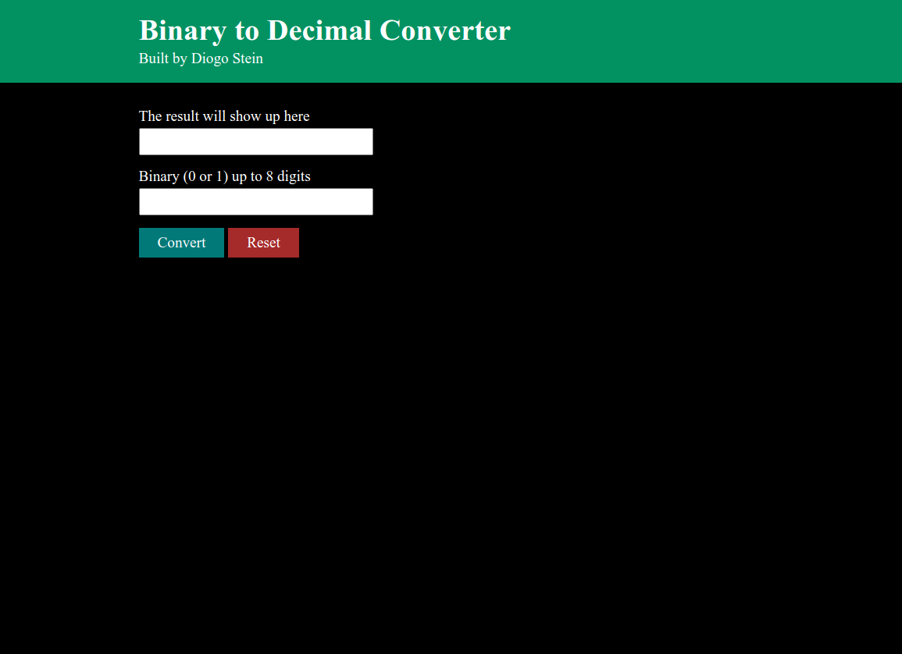

# A binary to decimal converter

This is a binary to decimal converter.

## Demo

https://thediogostein.github.io/bin-to-dec/

## Lessons Learned

This project was great to practice my problem solving skills. I had to figure out how to calculate the result. It took a little time to figure out the logic, but it was worth it. I learned a lot from this mini project.

## Screenshots

